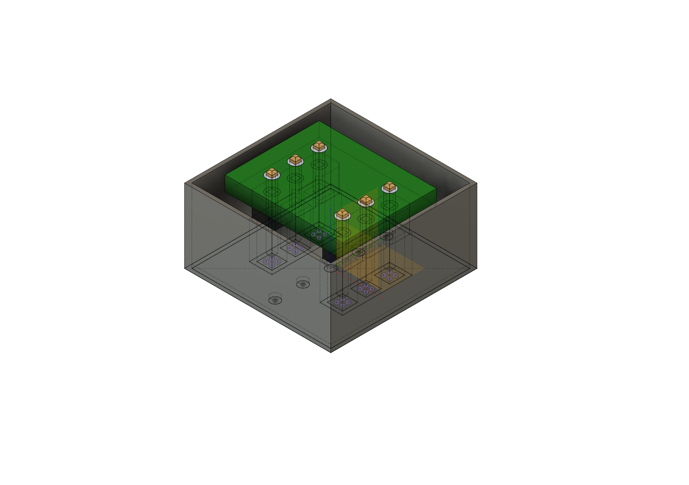
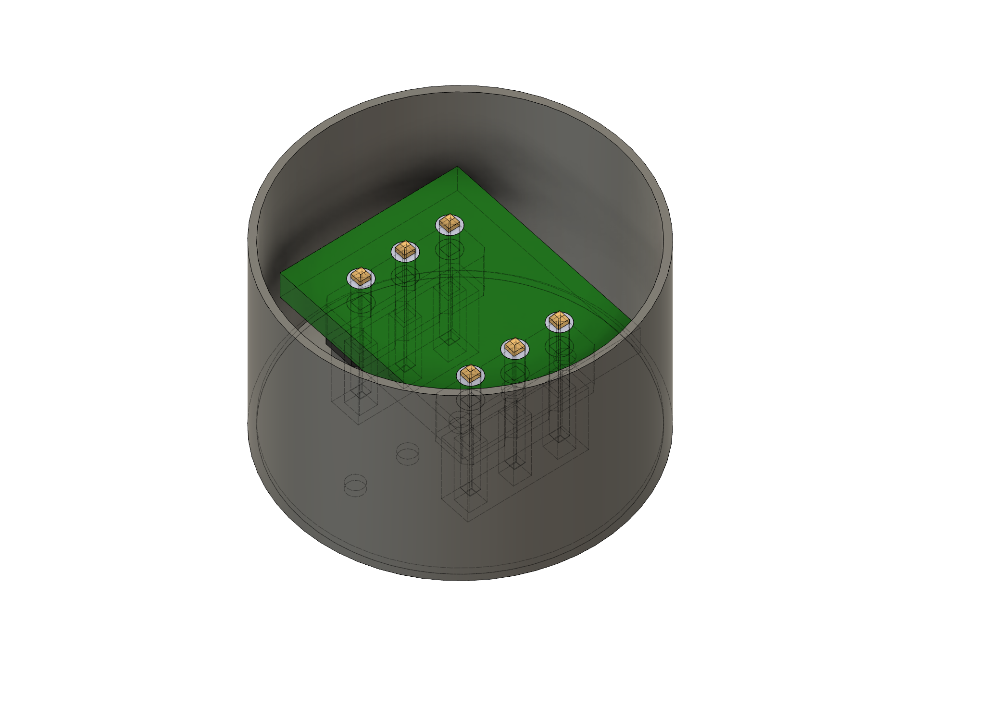

# Research Assets: MOSFET Dynamics in AC Fields

## Project Overview
**Affiliation:** Rutgers University  
**Research Context:** Under Professor Shan
This repository contains the mechanical engineering assets designed to assist in experimental research regarding the movement of MOSFETs in aqueous environments under the influence of alternating current (AC) fields. 

The primary design challenge was to create stable, buoyant fixtures that could suspend a MOSFET adapter in water while allowing for precise, variable placement of connecting wires (electrodes) to introduce the AC field.

---

## Design Evolution & Folder Structure

I have organized this repository chronologically to show the iterative engineering process used to solve stability and electrode-spacing challenges.

### [1. Square Floating Fixture](./1_Square_Boat/)
* **The Design:** A rectangular floating chassis designed to hold the MOSFET adapter.
* **Research Function:** Features pass-through holes at the bottom of the hull to allow connection wires to travel from the MOSFET adapter into the water.
* **Key Learning:** This initial prototype proved the concept of buoyancy but lacked the stability needed for precise field testing.
* 

### [2. Cylindrical Floating Fixture](./2_Circle_Boat/)
* **The Design:** A circular hull with significantly taller walls.
* **Research Function:** Replaced the square prototype to improve experimental consistency.
* **Key Learning:** The symmetry of the circle provided much better stability in the water, and the taller walls prevented splashing from shorting the MOSFET electronics.
* 

### [3. Modular Electrode Bridge](./3_Bridge_Modular/)
* **The Design:** A mounting bridge designed to sit on a separate O-ring structure.
* **Research Function:** Specifically designed to hold MOSFET wires at various fixed distances from each other.
* **Key Learning:** This allowed for testing how different electrode gaps affected the movement of the MOSFET in the AC field.
* 

### [4. Integrated Electrode Bridge](./4_Bridge_Integrated/)
* **The Design:** A unified version of the bridge with the O-ring geometry built directly into the part.
* **Research Function:** Streamlines the experimental setup.
* **Key Learning:** By integrating the O-ring into the CAD design, I reduced the "wiggle" in the setup, leading to more repeatable data collection.
* 

---

## Technical Details
* **Software:** Autodesk Fusion 360
* **File Formats:** * `.f3d`: Native Archive (includes full parametric timeline and sketches).
    * `.png`: Visual render for quick reference.
* **Fabrication:** Designed for 3D printing (FDM).

## How to View
To see the design process, download the `.f3d` files from the folders above and open them in Fusion 360. This will allow you to see every step of the design history.

---
Fisayo Ogunsulire, 2026 - Rutgers University Research Assistance
